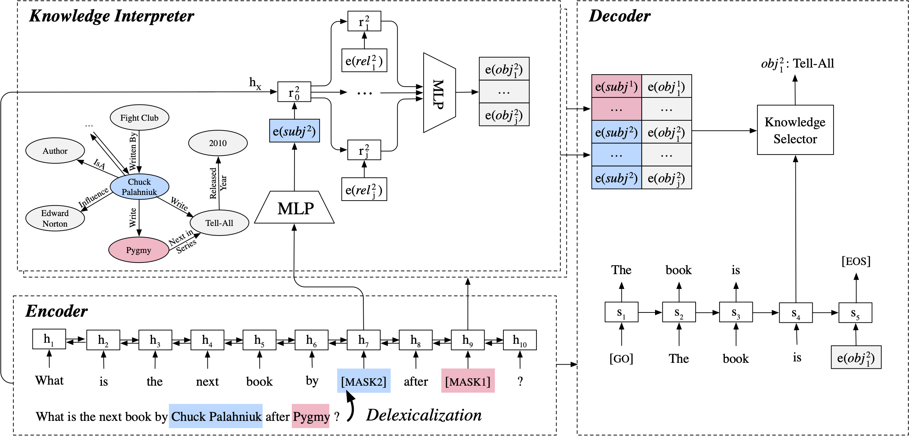

# EARL: Informative Knowledge-Grounded Conversation Generation with Entity-Agnostic Representation Learning

Generating informative and appropriate responses is vital for the success of human-like dialogue systems. In this work, we propose an Entity-Agnostic Representation Learning (EARL) method to introduce knowledge graphs to informative conversation generation. Unlike traditional approaches that parameterize the specific representation for each entity, EARL utilizes the context of conversations and the relational structure of knowledge graphs to learn the category representation for entities, which is generalized to incorporating unseen entities in knowledge graphs into conversation generation. Automatic and manual evaluations demonstrate that our model can generate more informative, coherent, and natural responses than baseline models. The overview of EARL is shown as follows.



This project is a tensorflow implementation of our work, [EARL](https://aclanthology.org/2021.emnlp-main.184/).

## Dependencies

* Python 3.5.2
* Tensorflow 1.14.0

Please see ```requirements.txt``` for more details.

## Usage

* Data

  Please unzip files in the `./data` folder before training and test.

* Train

  ```shell bash scripts/train_duconv.sh ```

  ```bash scripts/train_opendialkg.sh ```

* Test

  ```bash scripts/test_duconv.sh ```

  ```bash scripts/test_opendialkg.sh ```

  

## Paper

Hao Zhou, Minlie Huang, Yong Liu, Wei Chen, Xiaoyan Zhu  
[EARL: Informative Knowledge-Grounded Conversation Generation with Entity-Agnostic Representation Learning](https://aclanthology.org/2021.emnlp-main.184/)  
EMNLP 2021, Online and Punta Cana, Dominican Republic.

**Please kindly cite our paper if this paper and the code are helpful.**


```bib
@inproceedings{zhou-etal-2021-earl,
    title = "{EARL}: Informative Knowledge-Grounded Conversation Generation with Entity-Agnostic Representation Learning",
    author = "Zhou, Hao  and
      Huang, Minlie  and
      Liu, Yong  and
      Chen, Wei  and
      Zhu, Xiaoyan",
    booktitle = "Proceedings of the 2021 Conference on Empirical Methods in Natural Language Processing",
    month = nov,
    year = "2021",
    address = "Online and Punta Cana, Dominican Republic",
    publisher = "Association for Computational Linguistics",
    url = "https://aclanthology.org/2021.emnlp-main.184",
    pages = "2383--2395",
}
```


## License

Apache License 2.0
